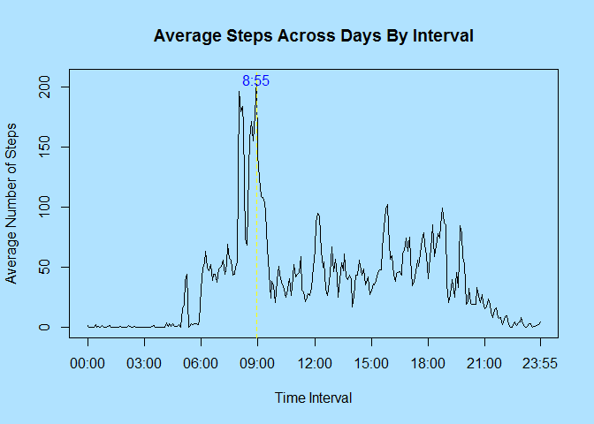
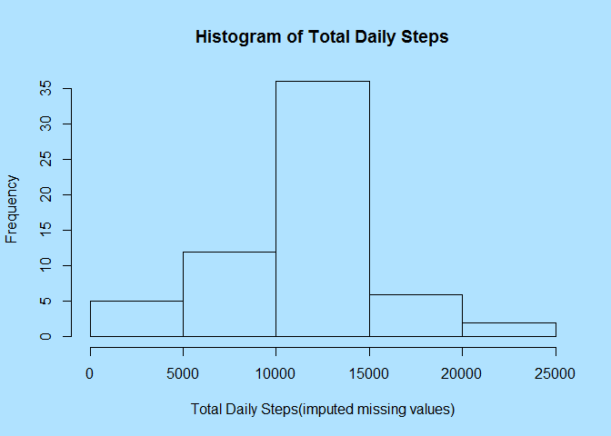

# Reproducible Research: Peer Assessment 1

## Loading and preprocessing the data


```r
require(dplyr)
activity.file <- unzip("activity.zip")
activity.data <- read.csv(activity.file)
activity.data.filtered <- na.omit(activity.data)
daily.steps <- activity.data.filtered  %>% group_by(date) %>% summarise(total=sum(steps)) 
interval.total.steps <- activity.data.filtered %>% group_by(interval) %>% summarise(total=sum(steps))
```


## What is mean total number of steps taken per day?

```r
mean.daily.steps <- mean(daily.steps$total)
median.daily.steps <-median(daily.steps$total)
par(bg = "lightskyblue1")

hist(daily.steps$total, xlab="Total Daily Steps", main= "Histogram of Total Daily Steps")
```

 

+ **Mean Total Daily Steps   :  _10766.19_**
+ **Median Total Daily Steps : _10765_**


## What is the average daily activity pattern?


```r
max.step.interval <- interval.total.steps$interval[which.max(interval.total.steps$total)]
par(bg = "lightskyblue1")
plot(interval.total.steps,type="l", xlab="Time Interval", ylab="Total Number of Steps", main = "Total Steps Across Days By Interval")
abline(v=max.step.interval, col="yellow" , lwd=1, lty =2)
text(toString(max.step.interval), x= max.step.interval, y = max(interval.total.steps$total),col="blue")
```

 


+ **The 5 minute interval across all days in the dataset containing the maximum number of total steps is   _835_**


## Imputing missing values


```r
na.steps <- sum(is.na(activity.data$steps))
```

1. **The  number of rows in the dataset missing  steps is   _2304_  (out of _17568)_**


```r
activity.data.imputed <- activity.data
for(i in 1:nrow(activity.data)) {
    if(is.na(activity.data[i,1]) == TRUE) {
      activity.data.imputed[i,1] <- round(interval.total.steps$total[which(interval.total.steps$interval ==  activity.data[i,3])]/length(unique(activity.data$date)))
    }
}
daily.steps.imputed <- activity.data.imputed  %>% group_by(date) %>% summarise(total=sum(steps)) 
mean.daily.steps.imupted <- mean(daily.steps.imputed$total)
median.daily.steps.imputed <-median(daily.steps.imputed$total)


par(bg = "lightskyblue1")
hist(daily.steps.imputed$total, xlab="Total Daily Steps(imputed missing values)", main= "Histogram of Total Daily Steps")
```

 


+ **Mean Total Daily Steps  (with imputed data) :  _10766.19_**
+ **Median Total Daily Steps (with imputeddata) : _10765_**


## Are there differences in activity patterns between weekdays and weekends?


```r
activity.data.imputed<- 
  mutate(activity.data.imputed, daytype = 
           factor(ifelse( weekdays(as.Date(date,"%Y-%m-%d")) %in% c("Saturday","Sunday"),"Weekend","Weekday")))
require(lattice)
```

```
## Loading required package: lattice
```

```r
par(bg = "lightskyblue1")
xyplot(steps ~ interval| levels(daytype), 
           data = activity.data.imputed,
           type = "l",
           xlab = "Interval",
           ylab = "Number of steps",
           layout=c(1,2))
```

 

